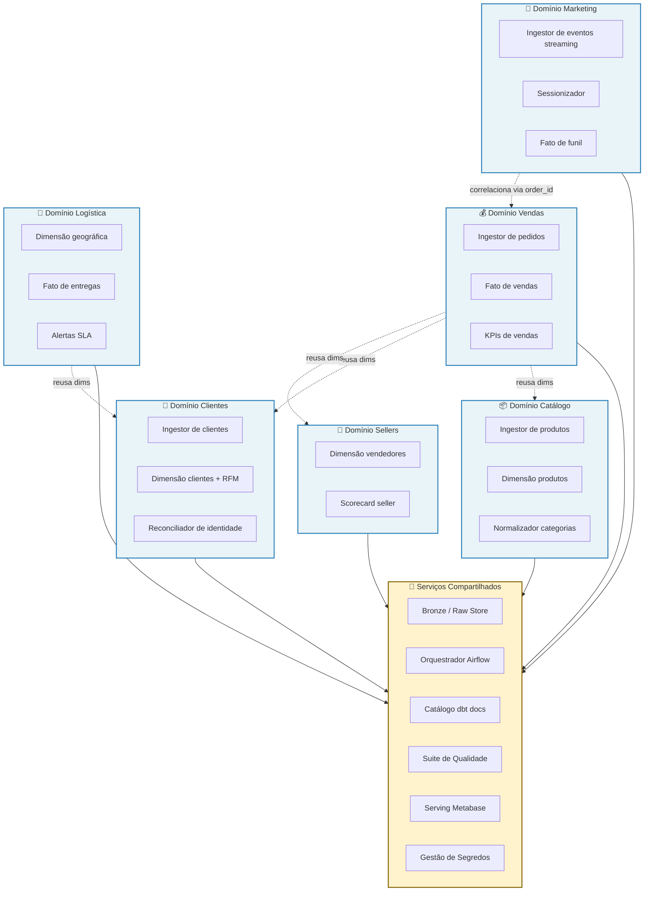

# 4.3 — Domínios e Serviços

Este documento identifica os **domínios de negócio** envolvidos no OlistFlow e os **serviços** que compõem cada domínio, seguindo princípios de **Domain-Driven Design (DDD)**. A organização por domínios é intencional: reflete a forma como um marketplace real estrutura seus times e sistemas, facilitando futura evolução para arquitetura orientada a domínios (Data Mesh) caso o projeto cresça.

## Princípio de desenho

Cada **domínio** representa uma área de negócio com ownership claro, linguagem ubíqua própria e dados específicos. Um **serviço** é uma capacidade computacional — pode ser uma aplicação, um job, uma view ou um endpoint — que pertence a um único domínio ou, excepcionalmente, é compartilhado entre vários. A separação por domínios **não** implica em uma arquitetura de microsserviços distribuída (o OlistFlow é um monólito organizado); ela existe para estruturar o raciocínio sobre responsabilidades, reuso e evolução.

---

## Domínios de negócio identificados

### 1. Vendas

**Responsabilidade:** captura, processamento e estado dos pedidos ao longo do seu ciclo de vida (desde a intenção de compra até o fechamento do pedido).

**Fontes de dados:** tabelas `orders`, `order_items`, `order_payments` (Olist Postgres); eventos `checkout_start`, `checkout_abandon`, `purchase` (clickstream).

**Serviços do domínio:**
- **Ingestor de pedidos (batch)** — lê pedidos do Postgres diariamente, grava em Bronze.
- **Modelador de fato de vendas** — produz `fct_pedidos` na Gold, com grão "uma linha por item de pedido".
- **Calculadora de KPIs de vendas** — views que agregam GMV, ticket médio, conversão, mix de categoria.

### 2. Catálogo

**Responsabilidade:** informações sobre produtos, categorias e sua hierarquia. É domínio de **dados de referência** — muda pouco, é consultado muito.

**Fontes de dados:** tabelas `products`, `product_category_name_translation`.

**Serviços do domínio:**
- **Ingestor de produtos** — snapshot completo diário (tabela pequena, não compensa CDC).
- **Dimensão de produtos** — `dim_produtos` na Gold, com tratamento SCD Tipo 2 para mudanças de categoria/peso.
- **Normalizador de categorias** — consolida nomes em português e inglês em uma única coluna canônica.

### 3. Clientes

**Responsabilidade:** identidade dos compradores, sua geografia e comportamento agregado.

**Fontes de dados:** tabela `customers`; eventos `page_view` e `search` com `user_id`; tabela `order_reviews` (opinião pós-compra).

**Serviços do domínio:**
- **Ingestor de clientes** — snapshot diário.
- **Dimensão de clientes** — `dim_clientes` na Gold, enriquecida com métricas RFM (Recência, Frequência, Valor monetário).
- **Reconciliador de identidade** — cruza `customer_id` do ERP com `user_id` dos eventos via `order_id` (após a compra).

### 4. Logística

**Responsabilidade:** transporte físico do produto até o cliente e SLAs associados.

**Fontes de dados:** campos `order_delivered_*`, `order_estimated_delivery_date` em `orders`; `geolocation` para cálculo de distância.

**Serviços do domínio:**
- **Dimensão geográfica** — `dim_geo` na Gold, com centroides de CEP e distância origem-destino.
- **Fato de entrega** — `fct_entregas` com prazos prometidos vs. realizados.
- **Alertas de atraso** (Parte 2, opcional) — job que identifica pedidos em risco.

### 5. Marketing / Comportamento

**Responsabilidade:** jornada do usuário no site, funil de conversão e atribuição.

**Fontes de dados:** eventos de clickstream completos (todos os tipos).

**Serviços do domínio:**
- **Ingestor de eventos (streaming)** — consome Redis Streams a cada 5 minutos, grava em Bronze.
- **Sessionizador** — agrupa eventos por `session_id` em uma dimensão de sessões.
- **Fato de funil** — `fct_funil` com estados por sessão (visitou, buscou, adicionou ao carrinho, comprou, abandonou).

### 6. Sellers (Vendedores)

**Responsabilidade:** cadastro e performance dos vendedores do marketplace.

**Fontes de dados:** tabela `sellers`; métricas derivadas de `order_items` e `order_reviews`.

**Serviços do domínio:**
- **Dimensão de vendedores** — `dim_vendedores` na Gold.
- **Scorecard de vendedor** — view na Gold com NPS, prazo médio, taxa de cancelamento por seller.

---

## Serviços compartilhados (cross-domain)

Alguns serviços não pertencem a nenhum domínio específico — são capacidades transversais que todos os domínios consomem. Mantê-los isolados evita duplicação e cria pontos únicos de evolução/correção.

| Serviço compartilhado | Uso | Implementação |
|-----------------------|-----|---------------|
| **Camada Bronze (Raw Store)** | Todos os domínios escrevem aqui | Diretório de Parquet particionado |
| **Orquestrador (Airflow)** | Dispara e monitora jobs de todos os domínios | DAGs por domínio + DAG mestre |
| **Catálogo de dados (dbt docs)** | Documentação viva das transformações | Gerado automaticamente pelo dbt |
| **Suite de qualidade (dbt tests + Great Expectations)** | Testes aplicados a toda camada Silver/Gold | `schema.yml` + expectativas |
| **Camada de serving (Metabase)** | Consumo para todos os domínios | Um container, múltiplos dashboards |
| **Gestão de segredos** | Credenciais de Postgres, Redis, etc. | `.env` local + `.gitignore` estrito |

---

## Diagrama de domínios e serviços

## Matriz de responsabilidades

| Domínio | Entidades-chave | Fatos gerados | Dimensões geradas | Consumidores primários |
|---------|-----------------|---------------|-------------------|------------------------|
| Vendas | Pedido, Item, Pagamento | `fct_pedidos` | — | Executivos, Analistas |
| Catálogo | Produto, Categoria | — | `dim_produtos` | Todos os domínios |
| Clientes | Cliente, Review | — | `dim_clientes` | Marketing, Vendas |
| Logística | Entrega, CEP | `fct_entregas` | `dim_geo` | Operações |
| Marketing | Sessão, Evento | `fct_funil` | `dim_sessao` | Produto, Marketing |
| Sellers | Vendedor | — | `dim_vendedores` | Gestão de marketplace |

## Por que essa separação importa

1. **Ownership claro.** Em um time real, cada domínio teria um engenheiro/analista responsável — regressão em `fct_pedidos` é problema de quem cuida de Vendas, não de Marketing.
2. **Reuso sem duplicação.** `dim_clientes` é construída uma vez (domínio Clientes) e consumida por Vendas, Logística e Marketing — princípio de conformed dimensions de Kimball.
3. **Evolução independente.** A lógica de sessionização (Marketing) pode mudar sem afetar o fato de vendas.
4. **Preparação para Data Mesh.** Se o projeto crescer e cada domínio precisar se tornar um "data product" com API própria, a separação lógica já estará feita — bastaria empacotar.
