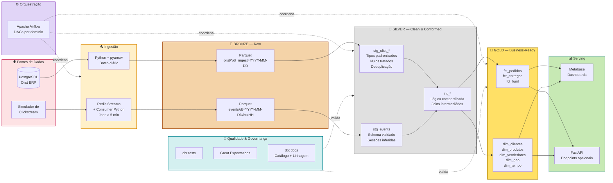

# 4.4 — Arquitetura e Fluxo de Dados

Este documento descreve **o que será feito** do ponto de vista arquitetural: o tipo de arquitetura escolhido, o fluxo de dados ponta-a-ponta, e os tradeoffs das decisões tomadas.

## Tipo de arquitetura escolhida

O OlistFlow adota uma **Arquitetura Medalhão (Medallion Architecture)** — também chamada de arquitetura multi-hop — implementada sobre um **Lakehouse conceitual** (arquivos Parquet organizados em diretórios + engine de consulta sobre eles), combinada com um caminho **Lambda "light"** que distingue batch de streaming na ingestão mas converge ambos na camada Gold.

Em síntese:

- **Medalhão:** três camadas de qualidade crescente — **Bronze** (raw), **Silver** (clean + conformed), **Gold** (business-ready, modelado dimensionalmente).
- **Lakehouse conceitual:** Parquet como formato de armazenamento analítico, DuckDB como engine SQL, dbt como camada de transformação. Não usamos Delta Lake / Iceberg por excesso de complexidade para o escopo, mas a topologia é **compatível** com migração futura.
- **Lambda light:** dois pipelines de ingestão paralelos (batch e streaming), cada um aterrissando em sua sub-pasta na Bronze, unificados na Silver.

### Por que Medalhão e não outras arquiteturas?

A disciplina apresentou múltiplas opções arquiteturais (Data Warehouse, Data Lake, Lakehouse, Lambda, Kappa, Data Mesh, Medalhão). Nossa escolha do Medalhão se apoia em três critérios: **adequação ao problema**, **viabilidade de execução** e **alinhamento com os princípios de engenharia de dados vistos em aula**.

| Arquitetura | Por que não ganhou | Por que não descartada inteiramente |
|-------------|-------------------|-------------------------------------|
| **Data Warehouse puro (ETL clássico)** | Carrega dados já transformados, perdendo o raw — prejudica reprocessamento e análises exploratórias. Também não acomoda bem eventos semi-estruturados. | Informa o desenho da camada Gold (modelo dimensional Kimball). |
| **Data Lake puro** | Armazena tudo sem estrutura — vira "pântano de dados". Não cobre o critério de confiabilidade/qualidade da avaliação. | A Bronze é conceitualmente um data lake — ganha aqui como **camada**, não como arquitetura completa. |
| **Lambda puro (Spark + Kafka)** | Overkill pro escopo. Duas stacks paralelas completas (batch e streaming) exigem hardware inviável no contexto acadêmico. | O conceito de separar caminhos batch/streaming é preservado em versão leve. |
| **Kappa puro** | Trata tudo como streaming. Elegante conceitualmente mas desproporcional para o cenário: a maior parte dos dados é intrinsecamente batch (pedidos históricos). | Influencia a ideia de **reprocessar** eventos a partir do raw. |
| **Data Mesh** | Requer maturidade organizacional (múltiplos times com ownership independente) que um projeto acadêmico de 2 pessoas não reproduz. | A separação por domínios em 4.3 já prepara uma eventual evolução nessa direção. |
| **Medalhão** ✅ | — | **Vencedor:** cobre os requisitos da avaliação, roda em notebook, expressa princípios de camadas/acoplamento/reversibilidade de forma direta. |

## Princípios de engenharia de dados aplicados

A arquitetura Medalhão é uma **concretização** de princípios vistos em aula:

1. **Separação de responsabilidades (SoC) entre camadas.** Bronze captura, Silver limpa, Gold modela. Cada transição tem contrato claro.
2. **Imutabilidade do Bronze.** Dados brutos nunca são alterados — apenas acrescidos. Isso garante reversibilidade total: qualquer bug na Silver/Gold pode ser corrigido e reprocessado a partir do Bronze.
3. **Idempotência das transformações.** Cada execução do pipeline pode ser repetida sem efeito colateral — garantido pelo padrão `INSERT OVERWRITE PARTITION` dos modelos dbt.
4. **Linhagem (data lineage).** dbt gera um grafo automático que conecta fonte → Silver → Gold → KPI, visível no `dbt docs serve`.
5. **Qualidade como parte do pipeline.** Testes não são uma fase separada — são modelos do próprio dbt, rodam a cada execução, quebram o pipeline se falham em nível crítico.

---

## Diagrama do fluxo ponta-a-ponta

## Descrição do fluxo por etapa

### Origem → Ingestão

**Caminho batch.** Às 02h00 (horário de baixa atividade), o Airflow dispara o DAG `ingest_olist`. Um script Python com `psycopg2` e `pyarrow` consulta o PostgreSQL, converte cada tabela para Parquet (Snappy) e grava em `./data/bronze/olist/<tabela>/dt_ingest=YYYY-MM-DD/`. O job é idempotente: se rodar de novo para a mesma data, substitui a partição.

**Caminho streaming.** Paralelamente, o `simulator.py` emite continuamente eventos JSON em `Redis Streams`. Um consumer Python (também orquestrado pelo Airflow, mas em DAG com schedule de 5 minutos) lê o stream, agrupa eventos por hora, grava em `./data/bronze/events/dt=YYYY-MM-DD/hr=HH/events.parquet`. Em ambiente sem Redis, o simulador escreve direto no mesmo layout — simplificando o setup sem alterar o restante do pipeline.

### Bronze → Silver

Modelos dbt do tipo `staging` (prefixo `stg_`) leem diretamente do Parquet via DuckDB. Eles aplicam:

- Cast de tipos (datas em texto → `timestamp`, decimais em vírgula → `numeric`).
- Tratamento explícito de nulos (em vez de deixar propagar).
- Deduplicação baseada na chave natural + timestamp de ingestão (mais recente vence).
- Validação de esquema (dbt tests `not_null`, `unique`, `accepted_values`).

Modelos intermediários (`int_`) resolvem lógica reutilizável — ex: cálculo de "tempo até entrega" que é usado em múltiplos fatos.

### Silver → Gold

Modelos dbt do tipo `marts` produzem o modelo dimensional. Padrões aplicados:

- **Fatos** particionados por data do evento (`order_purchase_timestamp` para vendas, `event_timestamp` para funil).
- **Dimensões** com surrogate keys geradas via `md5(natural_key || effective_date)`.
- **Slowly Changing Dimensions Tipo 2** para atributos que mudam (ex: categoria de produto) — implementado via `dbt snapshot`.
- **Dimensão de tempo** pré-materializada com granularidade diária, cobrindo 2016–2030.

### Gold → Serving

Metabase conecta no DuckDB (modo arquivo) e expõe os modelos Gold como "coleção OlistFlow". Cinco dashboards iniciais cobrem: Visão Executiva, Análise de Vendas, SLA Logístico, Funil de Conversão e Performance de Sellers.

Endpoints FastAPI opcionais expõem agregados já calculados em JSON — útil se a Parte 2 incluir uma aplicação que consuma métricas (ex: app mobile de gestão).

### Orquestração

Airflow tem DAGs organizados por domínio (`vendas_daily`, `catalogo_daily`, `streaming_5min`, etc.) + um DAG mestre (`orquestra_diario`) que respeita dependências: ingestão → Silver → Gold → testes → atualização de dashboards.

### Qualidade e governança

- **dbt tests** rodam após cada `dbt run` — testes leves (not_null, unique, relationships, accepted_values).
- **Great Expectations** complementa com testes mais ricos (distribuições, outliers, referential integrity cross-table) em pontos críticos da Silver e da Gold.
- **dbt docs** gera site estático com catálogo, linhagem visual e descrições — disponibilizado localmente via `dbt docs serve`.

---

## Análise de tradeoffs

A avaliação pede discussão explícita de cinco dimensões. Abordamos cada uma reconhecendo onde a arquitetura é **forte** e onde ela **cede deliberadamente**.

| Dimensão | Como se manifesta no OlistFlow | Classificação |
|----------|-------------------------------|---------------|
| **Acoplamento** | Camadas se comunicam apenas via arquivos Parquet com schema contratado. Mudanças na Silver não quebram a Bronze; mudanças na Gold não afetam a ingestão. dbt expressa dependências declarativamente (`ref()`), permitindo análise de impacto antes de alterar. | ✅ **Baixo acoplamento** |
| **Escalabilidade** | Limitada a uma máquina — é o tradeoff explícito do projeto. DuckDB é single-node, Parquet no disco local. Porém, **a topologia é portável**: trocar DuckDB por Athena/BigQuery e Parquet local por S3 exige mudança de conexão no dbt, não redesenho. | ⚠️ **Vertical apenas na Parte 2; horizontal possível com mudança de engine** |
| **Disponibilidade** | Não é foco. Pipeline roda em batch diário + micro-batch de 5min. Falha do Airflow atrasa dados, mas não perde (o próximo run reprocessa). Serving via Metabase tem downtime se o container cai. | ⚠️ **SLA relaxado por design** |
| **Confiabilidade** | dbt tests + Great Expectations garantem que **dados inválidos não avançam**. Bronze imutável garante reprocessabilidade. Logs do Airflow registram toda execução. | ✅ **Alta para o escopo** |
| **Reversibilidade** | Bronze preserva raw indefinidamente. Qualquer transformação pode ser corrigida e toda a Silver/Gold reconstruída — na prática, um `dbt run --full-refresh` basta. Decisões de modelagem na Gold são expressas em SQL versionado no Git, revertíveis via `git revert`. | ✅ **Excelente** |

### Pontos em que conscientemente abrimos mão

1. **Não há alta disponibilidade real.** Um único nó serve tudo. Para o contexto acadêmico, isso é aceitável; em produção exigiria HA no Postgres, broker de eventos gerenciado e serving distribuído.
2. **Streaming é didático, não industrial.** Volumes e latências são baixas de propósito. O pipeline em produção real usaria Kafka + Flink/Spark Structured Streaming.
3. **Não há Data Catalog corporativo.** `dbt docs` cumpre o papel localmente; em produção seria complementado com Amundsen, DataHub, Collibra etc.
4. **Não há RBAC granular no consumo.** Metabase usa autenticação simples. Em produção precisaria mapear papéis por domínio.

Essas renúncias são **explícitas** porque atendem ao critério de viabilidade do enunciado ("planeje algo viável, lembrando das limitações de máquina"). Todas são recuperáveis em uma versão futura do projeto **sem alterar a topologia principal** — o que é exatamente a virtude que se espera de uma arquitetura Medalhão bem construída.

---

## Evolução futura (não escopo desta Parte)

A arquitetura foi desenhada para suportar, sem redesenho, evoluções que um marketplace real demandaria:

- **Migração para cloud:** Parquet local → S3; DuckDB → Athena ou Trino; Postgres → RDS. dbt continua igual.
- **CDC real em vez de snapshot diário:** Debezium capturando binlogs do Postgres → Kafka → ingestão.
- **Streaming industrial:** Kafka em vez de Redis Streams; Flink/Spark Streaming para transformações em tempo real; camada Silver em near-real-time via dbt incremental micro-batch.
- **Data Mesh:** cada domínio (Vendas, Logística, Marketing) vira um "data product" com ownership próprio, contrato versionado e SLA publicado — os limites lógicos já estão desenhados em 4.3.
