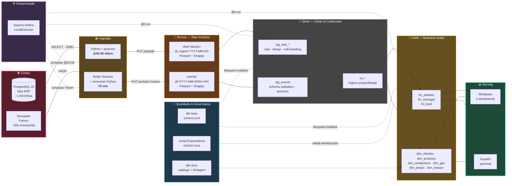
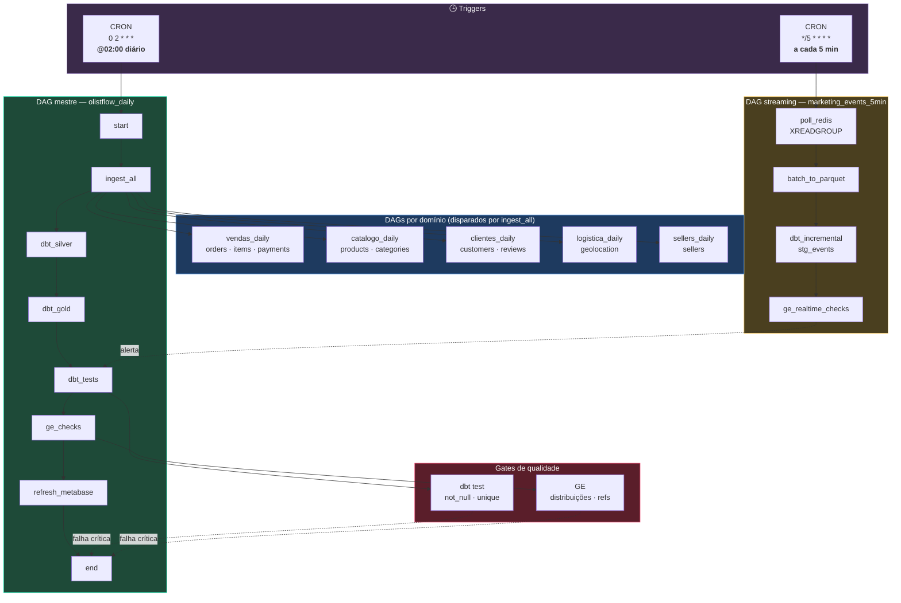
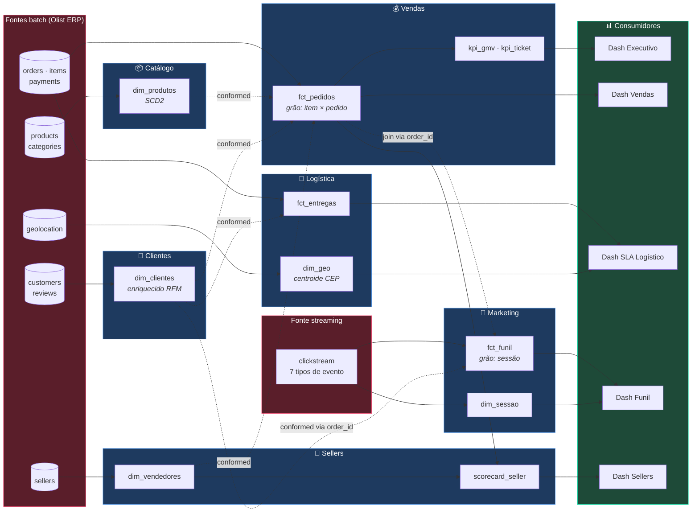
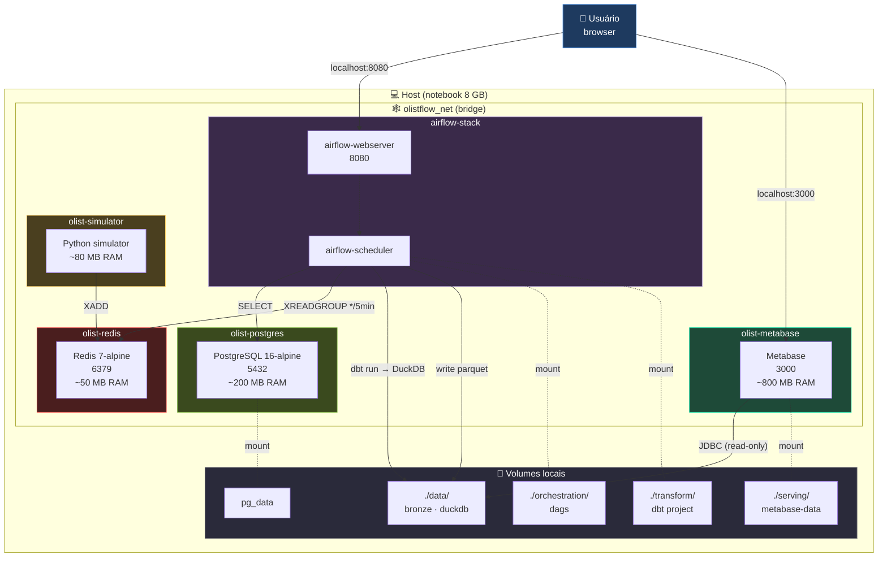

# 4.7 — Diagramas de Processamento de Dados

Este documento reúne os **diagramas profissionais** do pipeline OlistFlow que será implementado na Parte 2. Cada diagrama corresponde a uma vista distinta do mesmo sistema — o conjunto cobre as quatro perspectivas que um time de engenharia de dados normalmente precisa documentar:

| # | Vista | Responde à pergunta | Público-alvo |
|---|-------|---------------------|--------------|
| D1 | **Fluxo end-to-end** (lógico, com schedules) | Como os dados fluem da fonte ao dashboard? | Arquiteto, squad, stakeholder técnico |
| D2 | **Orquestração Airflow** (DAGs e dependências) | Qual DAG dispara o quê, e quando? | Engenheiro de dados, SRE/plantão |
| D3 | **DFD lógico por domínio** | Quem produz e quem consome cada data product? | Product owner, analista, novo integrante |
| D4 | **Deployment físico (Docker)** | Quais containers rodam, em que rede, com que volumes? | DevOps, quem vai executar na máquina local |

Todos os diagramas são escritos em **Mermaid** (renderizado direto pelo GitHub) e exportados em **PNG + SVG** em `docs/img/` para uso em relatórios/apresentações. Schedules estão anotados nos próprios diagramas para que a cadência do pipeline seja legível sem consultar os DAGs.

---

## D1 — Fluxo de processamento end-to-end

Mostra as camadas do Medalhão com os dois caminhos de ingestão (batch e streaming), os schedules de cada ponto de entrada, e as travessias de qualidade.



**Como ler este diagrama.** O fluxo avança da esquerda para a direita, cruzando as camadas de qualidade crescente do Medalhão. As linhas sólidas representam **fluxo de dados** (Parquet sendo escrito/lido); as tracejadas representam **controle** (Airflow dispara, dbt/GE validam). Anotações em negrito (`@02:00 diário`, `*/5 min`) são os schedules **reais** dos DAGs descritos em D2.

**Contratos implícitos:**

- Bronze → Silver: mesmo esquema relacional, tipagem canonizada.
- Silver → Gold: modelo dimensional (Kimball); chaves substitutas `md5(natural_key || effective_date)`.
- Gold → Serving: apenas leitura; consumidores nunca escrevem em DuckDB.

---

## D2 — Orquestração Airflow (DAGs e dependências)

Airflow opera dois ritmos: o **trem diário** das 02:00 (batch completo, dependências em cascata) e um **consumidor de streaming** que roda a cada 5 minutos, totalmente desacoplado do trem.



**Como ler.** Dois CRONs independentes alimentam dois fluxos. O **trem diário** é sequencial por design (a Silver depende do Bronze completo; Gold depende da Silver limpa). O **streaming** é fire-and-forget de 5 em 5 minutos, gravando em Bronze/events — o trem diário do dia seguinte consome essas partições normalmente. Gates de qualidade com falha crítica interrompem o pipeline antes do refresh dos dashboards, garantindo que **dado ruim nunca chega ao Metabase**.

**Princípio aplicado:** idempotência por sobrescrita de partição (`INSERT OVERWRITE`) — qualquer DAG pode ser religado para a mesma data sem duplicar registros.

---

## D3 — Fluxo de dados lógico por domínio (DFD)

Visão orientada a negócio: mostra **quem produz** e **quem consome** cada data product na camada Gold, destacando as dimensões conformadas (reusadas em múltiplos domínios).



**Como ler.** Setas sólidas são **produção**; tracejadas são **reuso entre domínios** (conformed dimensions). `dim_clientes` aparece 3× como conformed — é produzida **uma vez** pelo domínio Clientes e consumida por Vendas, Logística e Marketing. Essa é a concretização do princípio de Kimball vista em 03-dominios-servicos.md.

**Correlação batch↔streaming.** A seta `V_FCT ⟶ M_FCT "join via order_id"` mostra o ponto-chave: eventos de clickstream só se conectam ao comportamento transacional **após a compra**, via `order_id` emitido no evento `purchase`. Antes disso, `user_id` de marketing e `customer_id` de vendas são universos separados.

---

## D4 — Deployment físico (Docker Compose)

Como o stack é orquestrado na máquina local. Cada container é uma unidade de deploy independente; volumes persistem dados entre execuções.



**Como ler.** Todos os containers conversam pela rede `olistflow_net`. Portas expostas ao host: `5432` (Postgres para conectar com DBeaver/psql), `8080` (UI Airflow), `3000` (Metabase), `6379` (Redis para debug). O DuckDB **não é um container** — é um arquivo `.duckdb` dentro de `./data/`, aberto pelo Airflow-scheduler durante `dbt run` e pelo Metabase em modo leitura.

**Padrão de volumes.** Código fica na árvore do repositório (`./orchestration/dags`, `./transform`) e é montado nos containers — editar um modelo dbt localmente não exige rebuild. Dados (Bronze em Parquet, DuckDB) ficam em `./data/`, **fora do controle do Git** (`.gitignore`), garantindo que um clone novo comece limpo e o `make rebuild` regenere tudo a partir do Postgres + simulador.

**Total de memória em regime:** ~2,6 GB — deixa ≈5 GB livres no host de 8 GB para OS + browser + IDE, conforme matriz em 05-tecnologias.md.

---

## Anexos (PNG/SVG exportados)

Para uso em relatórios impressos, slides ou ambientes sem render Mermaid, cada diagrama tem versão estática gerada via `mermaid-cli` (`mmdc`):

| Diagrama | PNG | SVG |
|----------|-----|-----|
| D1 — Fluxo end-to-end | [d1-end-to-end.png](img/d1-end-to-end.png) | [d1-end-to-end.svg](img/d1-end-to-end.svg) |
| D2 — Orquestração Airflow | [d2-airflow-dags.png](img/d2-airflow-dags.png) | [d2-airflow-dags.svg](img/d2-airflow-dags.svg) |
| D3 — DFD por domínio | [d3-dfd-dominios.png](img/d3-dfd-dominios.png) | [d3-dfd-dominios.svg](img/d3-dfd-dominios.svg) |
| D4 — Deployment Docker | [d4-deployment-docker.png](img/d4-deployment-docker.png) | [d4-deployment-docker.svg](img/d4-deployment-docker.svg) |

Para regerar os anexos após editar um diagrama:

```bash
# a partir da raiz do repositório
npx -p @mermaid-js/mermaid-cli mmdc \
  -i docs/07-diagrama-processamento.md \
  -o docs/img/diagram.png \
  -t dark -b '#0d0d15' \
  --pdfFit
```

---

## Relação com os outros documentos

- **[04-arquitetura.md](04-arquitetura.md)** — justificativa da Arquitetura Medalhão; D1 é a versão visual "com cadência" daquele texto.
- **[03-dominios-servicos.md](03-dominios-servicos.md)** — D3 é a materialização DFD da divisão por domínios.
- **[05-tecnologias.md](05-tecnologias.md)** — D4 reflete a matriz consolidada de stack com os nomes de containers reais.
- **[02-dados.md](02-dados.md)** — volumes e formatos que sustentam D1.
